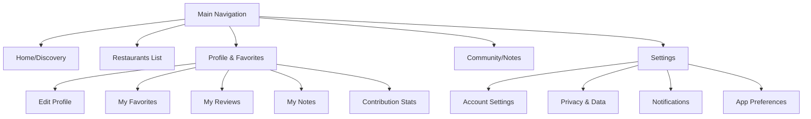
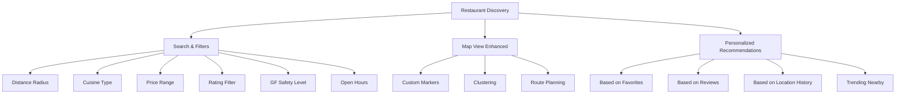
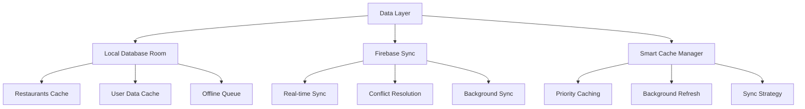
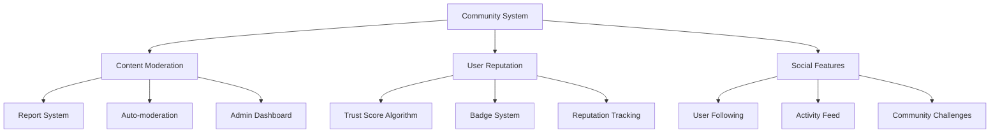
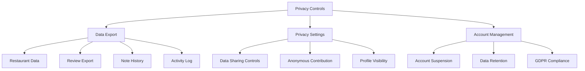

# FGlutenApp: Architecture Improvements & New Features

## Current Architecture Analysis

**Strengths:**
- ✅ Clean MVVM architecture with ViewModels and Repositories
- ✅ Firebase integration (Auth + Firestore) 
- ✅ Material Design UI components
- ✅ Bottom sheet navigation pattern
- ✅ Comprehensive restaurant data model
- ✅ User authentication and profile management
- ✅ Crowd-sourced notes and reviews system

**Areas for Improvement:**
- 🔧 Navigation could be enhanced (currently basic bottom sheets)
- 🔧 No offline capabilities or smart caching
- 🔧 Limited user profile management
- 🔧 Basic filtering and search capabilities
- 🔧 No content moderation system
- 🔧 Missing data export/privacy controls
- 🔧 No push notifications
- 🔧 Limited accessibility features

---

## 🚀 High Priority Improvements

### 1. Enhanced Navigation & User Profile System

**Current State:** Basic bottom sheets for settings
**Proposed Enhancement:** Comprehensive navigation with profile management

**Implementation Plan:**
- Replace basic bottom sheets with proper fragment navigation
- Add ProfileFragment with comprehensive user management
- Implement favorites management screen
- Add contribution statistics dashboard

### 2. Advanced Restaurant Discovery & Filtering

**Current State:** Basic list with distance sorting
**Proposed Enhancement:** Sophisticated discovery system

**Implementation Plan:**
- Add search functionality with autocomplete
- Implement multi-criteria filtering system
- Enhanced map with custom markers and clustering
- Recommendation engine based on user behavior

### 3. Offline-First Architecture with Smart Caching

**Current State:** No offline capabilities
**Proposed Enhancement:** Robust offline-first design

**Implementation Plan:**
- Add Room database for offline storage
- Implement smart caching strategies
- Create offline queue for user actions
- Add conflict resolution for sync

---

## 📊 Medium Priority Features

### 4. Content Moderation & Community Features

**Current State:** Basic crowd notes system
**Proposed Enhancement:** Robust community management

### 5. Data Privacy & Export Controls

**Current State:** Basic delete account
**Proposed Enhancement:** Comprehensive privacy management

---

## 🔔 Lower Priority Enhancements

### 6. Push Notification System

**Use Cases:**
- New restaurant discoveries nearby
- Friend activity and recommendations  
- Restaurant updates and menu changes
- Community achievement notifications
- App updates and news

### 7. Accessibility & Performance

**Accessibility Improvements:**
- Screen reader support
- High contrast themes
- Larger font options
- Voice navigation
- Touch target optimization

**Performance Optimizations:**
- Image lazy loading and caching
- Database query optimization
- Memory leak prevention
- Battery usage optimization
- Bundle size reduction

---

## 🛠 Implementation Recommendations

### Phase 1: Core Navigation & Profile (2-3 weeks)
1. Implement proper fragment navigation
2. Create comprehensive ProfileFragment
3. Add favorites management
4. Enhanced settings with privacy controls

### Phase 2: Discovery Enhancement (3-4 weeks)
1. Add search and filtering system
2. Enhanced map with clustering
3. Recommendation engine
4. Smart caching implementation

### Phase 3: Community & Moderation (4-5 weeks)
1. Content moderation system
2. User reputation algorithm
3. Social features
4. Data export functionality

### Phase 4: Advanced Features (2-3 weeks)
1. Push notification system
2. Accessibility improvements
3. Performance optimizations
4. Final testing and polish

---

## 💡 Additional Feature Ideas

### Restaurant Industry Integration
- **Delivery Platform Integration:** Partner with delivery apps for GF options
- **Reservations Integration:** OpenTable/Resy integration for GF-friendly restaurants
- **Health Department Data:** Integration with health inspection databases
- **Supply Chain Tracking:** Track GF ingredient sourcing

### Advanced AI Features
- **Menu AI Analysis:** Automatic GF item detection from menu photos
- **Predictive Recommendations:** ML-based restaurant suggestions
- **Review Sentiment Analysis:** AI-powered review quality assessment
- **Personalized Content:** Dynamic UI adaptation based on user preferences

### Business & Analytics
- **Restaurant Analytics Dashboard:** Provide insights to restaurant owners
- **Community Health Metrics:** Track GF safety trends by area
- **User Engagement Analytics:** Understand app usage patterns
- **Monetization Options:** Premium features, sponsored listings

---

## 🎯 Recommended Next Steps

1. **Start with Navigation Enhancement** - This provides foundation for other features
2. **Implement Smart Caching** - Critical for user experience
3. **Add Data Export** - Important for user privacy and GDPR compliance
4. **Enhance Search & Filtering** - Directly improves restaurant discovery
5. **Plan Content Moderation** - Essential as user base grows

Would you like me to start implementing any of these improvements? I'd recommend beginning with the **Enhanced Navigation & User Profile System** as it provides the foundation for most other features.